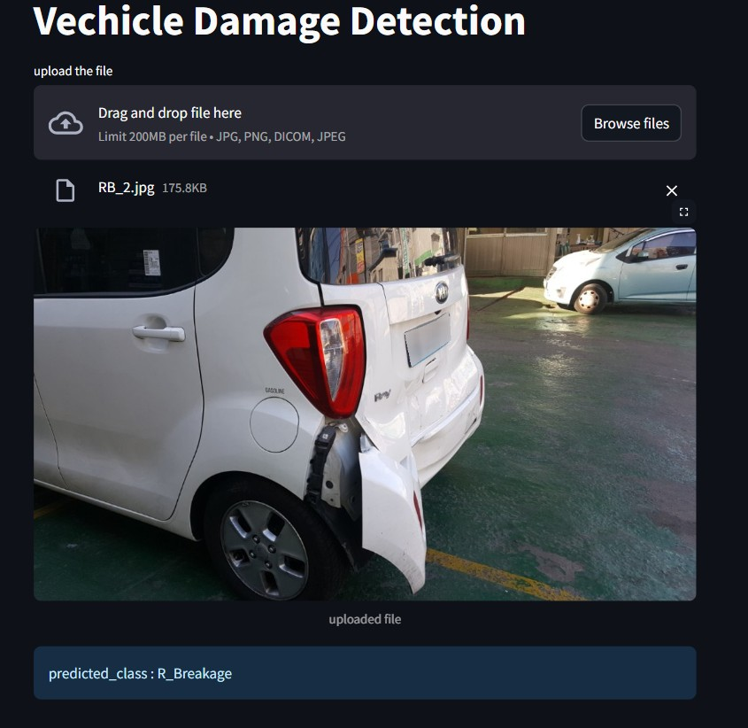

# 🚗 Vehicle Damage Classification


## 📌 Project Overview
This project is a **deep learning-based vehicle damage classification system** built using **ResNet-50**.  
It classifies vehicle damages into six categories and provides an easy-to-use **Streamlit web app** for real-time predictions.

🔹 **Key Features:**
- Uses **ResNet-50** for image classification.
- Allows users to **upload images** via a **Streamlit web app**.
- Provides **real-time predictions** for damage classification.
- Supports **six damage categories**:
  - **F_Breakage**
  - **F_Crushed**
  - **F_Normal**
  - **R_Breakage**
  - **R_Crushed**
  - **R_Normal**


## 🏗️ How This Project Works
1. **To get started, first install the dependencies using:** 
    ```commandline
     pip install -r requirements.txt
    ```
2. **Dataset loading and preprocessing**  
   - Run:  
     ```bash
     python dataset.py
     ```
3. **Dataset loading and preprocessing**  
   - Run:  
     ```bash
     python dataset.py
     ```
4. **Train the Model**  
   - Run:  
     ```bash
     python train.py
     ```
5. **Test the Model**  
   - Run:  
     ```bash
     python test.py
     ```
6. **Evaluate Model Performance**  
   - Run:  
     ```bash
     python Evaluvation.py
     ```
     This will generate:
      Accuracy Score
      Confusion Matrix Heatmap
      Precision, Recall, and F1-score for each class

## 🚀 How to Run the Web App
You can upload car images using a web app.
This app let's you drag and drop an image of a car and it will tell you what kind of damage it has.
The model is trained on third quarter front and rare view hence the picture should capture the third quarter front or rare view of a car. 

### **📸 Screenshot of the Web App**


To **start the web app**, run:
```bash
streamlit run app.py

